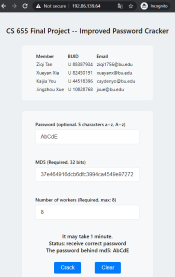
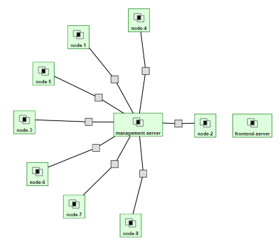

# Distributed-Password-Cracker

## Instructions
Design a distributed system (similar to Hadoop), where a user submits the md5 hash of a 5-character password (a-z, A-Z) to the system using a web interface. 

The web interface with the help of worker nodes cracks the password by a brute force approach. Students need to implement the web-interface as well as the management service that will dedicate jobs to worker nodes. The web-interface and the management service can be on the same machine, but worker nodes need to be different machines. The systems should be scalable, i.e. you can add/remove workers on the fly. The management service should use the REST API or socket programming to communicate with the worker nodes.

Skills: CGI-bin, socket programming.

## File structures
- ManagementServer: spring boot project of the management server.
- WorkerServer: spring boot project of the worker nodes.
- dispatcher: java code to dispatch jobs to different workers according to the input number of workers.
- doc
    - Proposal.
    - Project ideas.
    - Report instructions.
    - Project report.
- Geni-Rspec
- react-app: front end project.
- **screen-recording: the demo of the frontend part. The step-by-step instructions to reproduce the setup is in the "scripts" folder.** 
- scripts: the setup instructions to reproduce the experiment.
- worker: java code to run a job.
- Python-script: script to run the test on the management server.

## How to run this program?
Frontend service: 
http://192.86.139.64

## Topology and Design

There are 8 workers and a management server, a front-end server in our project.

- **Management server (Routable IP: 192.86.139.65)**:
The management server receives a request from a  front-end server, or handles multiple parallel requests from a Python crawler.  Then, it dispatches password cracking jobs and  forwards the request to workers based on the parameter from the request. 

- **Front-end Server (Routable IP: 192.86.139.64)**:
It provides web service for clients to send password cracking requests and assign an arbitrary number of workers to solve this problem.

- **Node1-Node8 (do not have routable IP)**: 
These are workers who crack passwords by a brute force approach with cache.

Clients can use the Web service we provide to send crack requests (via Restful API). We decouple the frontend and the backend. The crack requests are sent to the management server (backend service) from the browser. Then, the management server dispatches the jobs to different workers located on various machines. Once received the correct password from one of the workers, the management server will return it to the client/browser.

### Front-End
We use React to build our frontend application. After building the project, we deploy  it on the frontend server using the nginx as the Web server. 

We can access the frontend service via 192.86.139.64 (both PC and mobile are supported).  

#### User handbook
- **Password field**: users can use this to generate the MD5 easily and do not have to copy back and forth, but the crack request will only send the MD5 and the number of workers.
- **MD5 field**: you can paste your own MD5 here. 
- **Number of workers field**: you can change the number of workers on the fly, but we strongly suggest using 8 workers.
- **Crack button**: send the post request to the management server to get the password. It may take 1.5 minutes generally. After that, the correct password will be shown (e.g. “The password behind md5: AbCdE”). 
- **Clear button**: clear all the fields above.

#### Technology details 

- CORS(Cross-origin resource sharing) problem
The crack requests from the browser are cross-origin  requests, because the service in the browser is in origin http://192.86.139.64:80, while the backend service provides Restful API http://192.86.139.65:8080/getPassword. The services are provided from different origins. The browser does not allow that. Thus, we need to mark the response header as  cross-origin and allow origin http://192.86.139.64:80 to visit backend service to avoid the response being blocked by the browser.
- The post requests are sent with the JSON format body.

### Backend
The Back-End service is implemented by Restful API with Spring Boot framework.

By assigning specific link for the MessageController and use Annotation @RestController, the management server could handle a http request by "http://server-address:port-number/getPassword". 

#### Cache with concurrent hashmap
We use singleton design pattern to build a concurrent hashmap for the management server and each worker.

- The management server only caches the MD5s that requested before.
- Each worker caches when bruteforcing the results. 

We set a limited size for each hashmap, because each node only has 1 GB memory.

### Dispatcher and Worker

In this project, we target all 5-character password combinations with all upper and lower case English characters. Since there are 26 + 26 = 52 choices for each character, in total there are 5^52 = 380204032 possible password combinations from “aaaaa” to “ZZZZZ”. Here we know that all hashes are obtained from the MD5 hashing algorithm and no nonce is used. Thus, to crack the MD5 hashes, we can simply re-calculate hashes of all possible password combinations and match with the target to get the original password.

Our goal is to distribute tasks (hash all passwords from “aaaaa” to “ZZZZZ”) evenly to the requested number of workers.

Firstly, since our passwords contain both uppercase and lowercase characters and they are not consistent in the ASCII table, it is relatively hard to do calculations based on characters. Intuitively, we can map each character to integers respectively (‘a’ = 0, ‘z’ = 25, ‘A’ = 26, and ‘Z’ = 51 ) and calculate in base 52. Here we use it to provide the function to increment a string which we would use to loop through our problem set.

With the above helper functions, each worker can brute force the password by looping through its targeted range.

Then, it is the management server’s job to distribute tasks to each worker. It divides the total number of tasks evenly. Then use the above Increment function to find the start string and end string for each worker.

