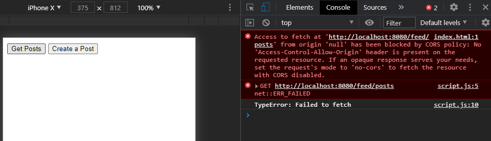

# Notes

## What I did?
1. Install express framework.
```
$ npm init
$ npm install --save express
$ npm install --save-dev nodemon
$ npm install --save body-parser
```

2. Modify package.json. Add a "start" field.
```json
"scripts": {
    "test": "echo \"Error: no test specified\" && exit 1",
    "start": "nodemon app.js"
  },
```


## How to run this?
```
$ npm start
```

In postman:
```json
// http://localhost:8080/feed/posts

// You will get
{
    "posts": [
        {
            "title": "First Post",
            "content": "This is the first post!"
        }
    ]
}
```


```json
// http://localhost:8080/feed/post
// with body:
{
    "title": "My second Post!",
    "content": "This is the content of my second post."
}

// You will get
{
    "message": "Post created successfully!",
    "post": {
        "id": "2020-11-17T20:40:11.324Z",
        "title": "My second Post!",
        "content": "This is the content of my second post."
    }
}
```


## How to avoid CORS error?

